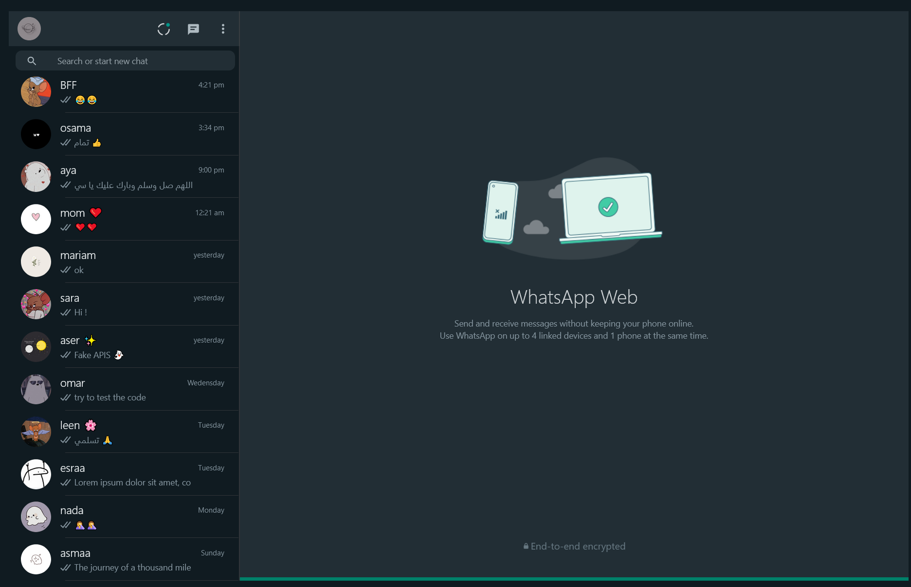

# Trying to simulate WhatsApp

<<<<<<< HEAD
Deploy The App: https://simulated-whatsapp.herokuapp.com/
=======

>>>>>>> da311a455e7ddcf3ca64133d52d55b74398a8938

## Welcome! 👋

I have tried to do a simulation of some of the pages of the WhatsApp website using React.js

if you have some advice to write better code please tell me.

### Built with

- React
- json Srver 
- React-Router-Dom
- JSX syntax
- Bootstrap
- CSS custom properties
- respnsive mobile screen

### What I learned

- better understand how to react app works 
- using json server and getting data from my fake local storge
- how to react use router-dom
- how code HTML & JS together 
- components concept

## Author

- Website - [Github-Account](https://github.com/asmaa-elfatayry)
- Behance - [Behance-Account](https://www.behance.net/asmaaomar13)
- LinkedIn - [LinkedIn-Account](https://www.linkedin.com/in/asmaa-elfatayry/)
